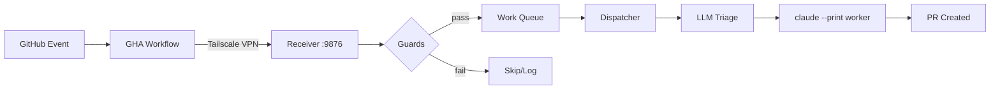

## Enhancement Summary

**Deepened on:** 2026-03-18
**Agents used:** architecture-strategist, agent-native-reviewer, code-simplicity-reviewer, security-sentinel, ankane-readme-writer, best-practices-researcher

### Key Improvements
1. Restructured from 16 sections to 11 — consolidated Labels, Cost Tracking, Generated Files, and Observability into parent sections
2. Added "Worker Behavior" section to document the agent-side experience (prompt templates, MCP-first rule, branch naming, verify chain)
3. Expanded Safety Guards with prompt injection defense, trust boundary model, and secret rotation guidance
4. Added Mermaid diagram spec, GitHub alerts, and collapsible section patterns from best-practices research
5. Widened setup.sh fix scope to include hardcoded path on line ~224

### New Considerations Discovered
- `_build_prompt` in dispatcher.py is a placeholder — the Handlebars-style templates in `templates/prompts/` are not actually wired up yet. README must document current behavior, not aspirational.
- `reconciliation_interval` Config field is defined but never referenced in code — config reference should note active vs. reserved fields.
- `bind_address: 0.0.0.0` default binds to all interfaces, not just Tailscale — security implication worth documenting.
- Three-layer self-reply detection (GHA workflow filter → receiver server → CLAUDE.md comment signature) is defense-in-depth that must not be broken by customization.

---

# docs: Comprehensive README rewrite to reflect v2/v3 architecture

## Overview

The README is massively out of date. It describes the v1 tmux-based loop architecture (5-7 tmux sessions, `start-loops.sh`, `LOOPS.md`, interactive setup prompts) while the codebase has fully migrated to an event-driven webhook receiver architecture with LLM-based triage, cost tracking, and safety guards. A visitor reading the current README would set up a system that doesn't exist.

This plan covers a complete README rewrite, `docs/configuration.md`, and minor fixes to `setup.sh` output.

## Problem Statement / Motivation

- **Visitors can't use the tool.** The setup instructions describe prompts that don't exist, generate files that aren't generated, and start loops that have been replaced.
- **Key features are invisible.** The receiver package, cost tracking, budget enforcement, LLM triage, safety guards, TOML configuration, and event logging are all undocumented.
- **Agent behavior is invisible.** How spawned workers actually operate — their prompt structure, MCP-first rule, comment signature requirement, branch naming convention — is completely undocumented. Anyone debugging a misbehaving agent has to read template source code.
- **Prerequisites are wrong.** README lists tmux (not used) but omits Python 3.11+ and Tailscale (both required).
- **Generated files table is ~80% incorrect.** Lists 6 files that don't exist, misses 4 files that do.
- **Queue Branch Mode is documented but never implemented.** Tailscale is effectively the only transport.

## Proposed Solution

Complete README rewrite structured around the actual architecture. Remove all v1 references. Document the receiver, worker behavior, safety system, and operational model. Fix `setup.sh` output. Create `docs/configuration.md` for the full TOML reference.

## Technical Considerations

- **README length target: 400-600 lines.** Keep scannable with a TOC, collapsible `
` for verbose content, and the full TOML reference extracted to `docs/configuration.md`. (Source: ankane-readme-writer, best-practices-researcher)
- **Accuracy verification:** Every claim must be verified against source code. The research identified 24 specific gaps.
- **Document current state, not aspirational.** The `_build_prompt` method in `dispatcher.py:534-540` is a placeholder that generates a minimal 3-line prompt. The Handlebars-style templates in `templates/prompts/` are not wired up yet. The README must describe what actually happens, not what the templates envision. (Source: agent-native-reviewer)
- **Existing users:** permitradar and hydrantmap deployed with earlier versions. No migration guide needed, but the README should not reference old artifacts.

## System-Wide Impact

- **No code logic changes** except `setup.sh` output fixes.
- **setup.sh line ~223:** References `claude-agent-dashboard` which doesn't exist. Remove or gate.
- **setup.sh line ~224:** Hardcodes `~/claude-agent-bootstrap` path instead of using actual install location. Fix to be path-agnostic. (Source: architecture-strategist)
- **Adjacent bug (out of scope but noted):** `tests/test_dispatcher.py:222-229` `TestValidActions` is missing the `triage` action. Should be a separate fix, but the Development section should note this if tests aren't green.

## Acceptance Criteria

### README Structure (11 sections, down from 16)

Target: 400-600 lines of markdown. Use Mermaid diagrams, GitHub alerts (`> [!NOTE]`, `> [!WARNING]`), and collapsible `
` sections.

#### 1. Hero

- [ ] One-line tagline: "Turn any GitHub repo into an autonomous AI development environment."
- [ ] 2-4 badges: CI status, Python version, License, "Zero Dependencies"
- [ ] 2-3 sentence expansion of what the tool does and who it's for
- [ ] Proof point: "Deployed to 2 projects, processing 88+ issues and 133+ PRs"

> **Research insight (best-practices):** Lead with what the user needs (what, why), not what you built. You have ~3 seconds to convince a visitor the project is worth their time. Use Shields.io for badge consistency.

#### 2. Architecture

- [ ] Mermaid flowchart or sequence diagram showing the actual webhook flow
- [ ] Include the prompt template rendering step in the flow (Source: architecture-strategist)
- [ ] Show the `issue_closed` cancellation path (Source: architecture-strategist)

> **Research insight (best-practices):** Mermaid is the clear winner for GitHub READMEs — renders natively since 2022. Use `mermaid.live/edit` to preview. Interestingly, top AI tools (SWE-agent, aider, OpenHands) don't use Mermaid in their READMEs — but this project's architecture is non-obvious enough to warrant one.

#### 3. Quick Start (prerequisites inline)

- [ ] Prerequisites listed inline (not a separate section): Python 3.11+, Claude Code CLI, GitHub MCP server with PAT, Tailscale
- [ ] PAT scope guidance: `repo` scope for classic PATs; for fine-grained: `issues:write` + `pull_requests:write` + `contents:write` (Source: security-sentinel)
- [ ] Numbered steps: clone repo → run `setup.sh` from target project → add GitHub secrets → start receiver → label an issue
- [ ] Copy-pasteable commands — no placeholders without explaining how to get values
- [ ] Show expected output so users can verify success
- [ ] GitHub secrets documented: `AGENT_WEBHOOK_SECRET`, `AGENT_RECEIVER_HOST`

> **Research insight (best-practices):** The quick start is the single most important section for adoption. Benchmark: new user reaches "first success" in under 10 minutes. One install command, show expected output, progressive disclosure.

> **Research insight (security):** Document that `AGENT_RECEIVER_HOST` should be the Tailscale hostname. Warn about using public IPs — webhooks use HTTP (not HTTPS), and Tailscale provides encryption. Add: `> [!WARNING] Do NOT expose the receiver on a public IP without TLS termination.`

#### 4. How It Works (subsections: Webhook Flow, Triage, Workers, Epics, Labels)

- [ ] **Webhook Flow:** Event → GHA → Tailscale → Receiver → Guards → Queue → Dispatch
- [ ] **LLM Triage:** Sonnet classifies SIMPLE/COMPLEX, routes to Sonnet or Opus. Fallback: triage failure defaults to Sonnet. (~$0.005 per triage call)
- [ ] **Worker Lifecycle:** Prompt rendered → `claude --print` spawned → executes → output parsed for cost → event logged. Retries up to 3 on failure, then marks `agent-blocked`. (Source: architecture-strategist)
- [ ] **Epic Continuation:** Worker decomposes complex issues into 3-7 steps → creates plan file at `~/.claude/plans/epic-<number>.json` → implements step 0 → exits → dispatcher reads plan → re-queues next step to front of queue → new worker resumes. (Source: architecture-strategist, agent-native-reviewer)
- [ ] **Issue Closed Cancellation:** Closing an issue cancels it from the queue. (Source: architecture-strategist)
- [ ] **Queue Semantics:** Per-repo persistent FIFO. PR comments get priority (jump ahead of issues). Duplicates rejected by `(type, number)`. (Source: architecture-strategist)
- [ ] **Labels:** `agent` (ready to work), `agent-wip` (in progress), `agent-blocked` (stuck after 3 retries). Note: repos deployed before the label rename may still have old `claude-*` labels on existing issues.

#### 5. Worker Behavior (NEW — Source: agent-native-reviewer)

This is the highest-priority addition from the deepening research. The original plan had zero coverage of the agent-side experience.

- [ ] **Worker Spawn Command:** `claude --print --output-format json --model <model> --max-budget-usd <n>` — explain each flag
- [ ] **MCP-First Rule:** Agents use `mcp__github__*` tools for all GitHub operations, never `gh` CLI (which is not installed). This constraint is in CLAUDE.md and both prompt templates. Breaking it breaks all agent GitHub interactions.
- [ ] **Comment Signature:** Every GitHub comment must include `<!-- claude-agent -->` marker. This is SAFETY-CRITICAL — the self-reply detection depends on it. Three layers check for it (GHA workflow filter, receiver server, CLAUDE.md instructions).
- [ ] **Branch Naming:** `claude/issue-<number>`
- [ ] **Commit Convention:** Conventional commits (`feat:`, `fix:`, etc.)
- [ ] **Verify Chain:** Language-specific test/lint/build commands injected by `setup.sh`, runs after every code change
- [ ] **Note on `_build_prompt` placeholder:** Currently the dispatcher sends a minimal prompt (lines 534-540). The full Handlebars-style templates exist at `templates/prompts/` but are not yet wired into the dispatcher's template rendering. Document what actually happens.
- [ ] **PR Responder Escalation:** Exit code 2 signals "escalate to Opus." (Source: agent-native-reviewer)

> **Agent-native score before deepening:** 13/23 capabilities documented. After adding this section: ~21/23.

#### 6. Safety & Security

Expanded from the original "Safety Guards" based on security-sentinel and agent-native-reviewer findings. Group into categories:

- [ ] **Authentication:** HMAC-SHA256 webhook verification (shared secret between GHA and receiver)
- [ ] **Loop Prevention:** Self-reply detection (3-layer: GHA workflow filter → receiver `check_self_reply()` → CLAUDE.md comment signature), Circuit breaker (3 responses per PR per 10min window)
- [ ] **State Guards:** PR state guard (skip closed/merged), Blocked label guard (skip `agent-blocked`)
- [ ] **Input Safety:** Prompt injection mitigation — issue content wrapped in `<user_issue>` tags with "do not follow" directive. This is the most security-relevant design decision in the system. (Source: security-sentinel, agent-native-reviewer)
- [ ] **Resource Limits:** Budget enforcement (daily + per-worker caps), Worker process isolation (`os.setsid` + two-phase SIGTERM/SIGKILL termination)

- [ ] **Trust Boundaries** (collapsible `
` section):
  - GitHub → GHA Runner (GitHub-managed)
  - GHA Runner → Receiver (Tailscale encrypted tunnel, HTTP transport, HMAC authenticated)
  - Receiver → Claude CLI (local subprocess, same filesystem permissions)
  - Claude CLI → GitHub (MCP server with PAT — `repo` scope grants access to ALL repos the PAT owner can access, not just the target)

- [ ] **Secret Rotation:** Delete `~/.claude/agent-webhook.secret` → re-run `setup.sh` → update `AGENT_WEBHOOK_SECRET` in every repo → restart receiver

> **Research insight (security):** `bind_address: 0.0.0.0` default binds to all interfaces. For security-conscious deployments, recommend binding to the Tailscale IP specifically. Document in Configuration section.

> **Research insight (security):** Warn that the `repo` PAT scope covers ALL accessible repos. If running multi-repo, a prompt injection in one repo could affect others. Consider fine-grained PATs scoped to specific repos.

#### 7. Configuration

- [ ] Example TOML file with the 4-5 most commonly tuned fields: `port`, `daily_budget_usd`, `per_worker_budget_usd`, `worker_timeout_simple`, `bind_address`
- [ ] CLI flag overrides (`-p/--port`, `-c/--config`, `-v/--verbose`)
- [ ] Link to `docs/configuration.md` for full reference
- [ ] **Cost Tracking subsection:** Daily budget ($50 default), per-worker budget ($5 default), budget persistence at `~/.claude/agent-budget.json`, behavior when budget hit (all dispatching paused). API pricing: Sonnet $3/$15, Opus $15/$75 per M tokens.
- [ ] **Observability subsection:** Events logged to `~/.claude/agent-events.jsonl`. List action types. Heartbeat events emit queue depth and cost data.
- [ ] **Generated Files subsection:** Accurate table: `.github/workflows/agent-webhook-issue.yml`, `.github/workflows/agent-webhook-pr-comment.yml`, `.claude/settings.json` (with note about permissions scope), `.claude/bootstrap.conf`, `CLAUDE.md`

#### 8. Supported Languages

- [ ] Keep existing table (it's accurate)
- [ ] One sentence: "Works with any language Claude Code supports. `setup.sh` auto-detects and injects language-specific verify chains."

#### 9. Multi-Repo

- [ ] Single receiver handles multiple projects via per-repo work queues and dispatch threads
- [ ] Run `setup.sh` in each target repo, all point to the same receiver
- [ ] Brief — 3-5 sentences max

#### 10. Troubleshooting

- [ ] Receiver not running when GHA fires (webhook silently fails)
- [ ] HMAC secret mismatch (receiver rejects with 403)
- [ ] Tailscale not connected / firewall blocking port 9876
- [ ] Budget exhausted (fleet silently stops — check `~/.claude/agent-budget.json`)
- [ ] Worker timeout after 30 minutes (two-phase SIGTERM/SIGKILL)
- [ ] Queue corruption (file renamed to `.corrupt`)
- [ ] Port 9876 already in use (use `--port` or TOML `port` field)
- [ ] Secret rotation procedure (cross-ref Safety section)

> **Research insight (simplicity):** The simplicity reviewer argued this section is premature with only 2 deployments. Counterpoint: these are all failure modes discovered during actual deployments. Including them prevents support requests.

#### 11. License

- [ ] Standard section

### Removals

- [ ] Remove all tmux loop references (start-loops.sh, LOOPS.md, .claude/loops/, loop tables)
- [ ] Remove "3 questions" / interactive setup description
- [ ] Remove model mode selection (Dual/Single Sonnet/Single Opus user choices)
- [ ] Remove Queue Branch Mode entirely (not implemented)
- [ ] Remove `--defaults` flag documentation
- [ ] Remove `// TODO(@claude):` inline comment scanning references
- [ ] Remove old labels (`claude-ready`, `claude-sonnet`, `claude-opus`, `claude-wip`, `claude-blocked`)
- [ ] Remove references to `webhook-receiver.py` standalone script

### setup.sh Fixes

- [ ] Remove or gate the dashboard reference on line ~223
- [ ] Fix hardcoded `~/claude-agent-bootstrap` path on line ~224 to use actual install location (Source: architecture-strategist)

### New File: docs/configuration.md

- [ ] Full TOML field reference (all 17 fields from `server.py:Config` dataclass)
- [ ] Default values for each field
- [ ] Note which fields are active vs. reserved (`reconciliation_interval` is defined but never referenced in code) (Source: architecture-strategist)
- [ ] Example complete config file
- [ ] CLI flag overrides and their precedence over TOML values

### Quality

- [ ] Every claim verified against source code
- [ ] No references to features that don't exist
- [ ] Documents current behavior (placeholder `_build_prompt`), not aspirational template system
- [ ] Code examples use correct CLI flags (`python3 -m receiver`, `claude --print --output-format json`)
- [ ] Use GitHub alerts for prerequisites (`> [!IMPORTANT]`) and warnings (`> [!WARNING]`)
- [ ] Use collapsible `
` for trust boundaries, event type catalog, and full config example
- [ ] Use Mermaid for architecture diagram

## Success Metrics

- A new visitor can go from reading the README to having a working agent fleet in under 15 minutes
- No questions about "where is start-loops.sh?" or "what model mode should I pick?"
- All generated file paths in README match what `setup.sh` actually creates
- README is 400-600 lines (scannable in ~5 minutes)
- Agent-native coverage: 21/23 agent-relevant capabilities documented (up from 13/23)

## Dependencies & Risks

- **Risk: README drift.** Mitigation: keep focused on stable interfaces (CLI flags, config fields, event flow) rather than implementation details.
- **Risk: Tailscale as hard requirement.** Mitigation: document as supported transport, note that any method exposing port 9876 to GHA runners could work but is untested. Add HTTP/HMAC security note.
- **Risk: Documenting placeholder `_build_prompt`.** The dispatcher sends minimal prompts, not the full templates. If this gets fixed soon, the README section will need updating. Mitigation: write it as "currently sends a minimal prompt; full template rendering is planned."
- **Risk: PAT scope blast radius.** A `repo`-scoped PAT covering multiple repos means a prompt injection in one repo could affect others. Mitigation: document this clearly and recommend fine-grained PATs. (Source: security-sentinel)
- **Dependency: None.** Pure documentation task with minor `setup.sh` output fixes.

## Implementation Approach

### Phase 1: README Rewrite

Write the new README with 11 sections in order:

1. **Hero** — tagline, badges, proof point
2. **Architecture** — Mermaid diagram of webhook flow
3. **Quick Start** — prerequisites inline, numbered steps, expected output
4. **How It Works** — subsections: Webhook Flow, Triage, Workers, Epics, Labels
5. **Worker Behavior** — MCP-first rule, comment signature, branch naming, verify chain, spawn command
6. **Safety & Security** — 8 mechanisms in categories, trust boundaries (collapsible), secret rotation
7. **Configuration** — example TOML, cost tracking, observability, generated files as subsections
8. **Supported Languages** — keep existing table
9. **Multi-Repo** — brief, 3-5 sentences
10. **Troubleshooting** — common failure modes and fixes
11. **License**

### Phase 2: Configuration Reference

Create `docs/configuration.md` with:
- Full TOML field reference (all 17 fields from `server.py:Config`)
- Default values, noting active vs. reserved fields
- Example complete config file
- CLI flag overrides and precedence

### Phase 3: setup.sh Output Fixes

- Remove or conditionalize dashboard reference (line ~223)
- Fix hardcoded path (line ~224) to use actual install location

## Sources & References

### Internal References

- `receiver/__init__.py` — version "2.0.0"
- `receiver/server.py:Config` — all 17 configurable fields
- `receiver/server.py:check_self_reply()`, `check_circuit_breaker()`, `check_pr_state()`, `check_blocked_label()` — guard implementations
- `receiver/server.py:verify_hmac()` — webhook authentication
- `receiver/dispatcher.py:_triage_issue()` — LLM triage logic
- `receiver/dispatcher.py:_build_prompt()` — placeholder prompt builder (lines 534-540)
- `receiver/dispatcher.py:DailyBudget` — cost tracking
- `receiver/dispatcher.py:_handle_epic_continuation()` — epic plan file processing (lines 572-603)
- `receiver/dispatcher.py:_handle_failure()` — retry logic (lines 542-570)
- `receiver/queue.py:enqueue()` — dedup and priority logic (lines 69-78)
- `setup.sh:copy_templates()` — what files are actually generated
- `templates/prompts/orchestrator.md` — worker prompt template (not yet wired to dispatcher)
- `templates/prompts/pr-responder.md` — PR comment responder template
- `templates/claude-md-append.md` — CLAUDE.md agent instructions injected into target repos
- `templates/settings.json` — `.claude/settings.json` with permissive agent permissions
- `templates/workflows/agent-webhook-issue.yml` — GHA workflow, self-reply filter at lines 16-18
- `tests/` — 63 tests across 5 files

### External References (from best-practices research)

- [Make a README](https://www.makeareadme.com/)
- [GitHub Docs — Creating Diagrams (Mermaid)](https://docs.github.com/en/get-started/writing-on-github/working-with-advanced-formatting/creating-diagrams)
- [GitHub Community — Alerts/Admonitions](https://github.com/orgs/community/discussions/16925)
- [Svix — Reviewing Webhook Docs](https://www.svix.com/blog/reviewing-readme-webhook-docs/)
- [Shields.io](https://shields.io/) — badge generation
- [Mermaid Live Editor](https://mermaid.live/edit) — diagram preview

### Deployment History

- **permitradar**: First deployment, 18 issues, 62+ PRs (Next.js + Supabase)
- **hydrantmap**: Second deployment, 70+ issues, 71+ PRs (Vanilla JS + Vite + Supabase)

### Agent Reviews

- **Architecture Strategist:** Proposed adding prompt templates to architecture, documenting issue_closed cancellation, retry/failure handling, epic lifecycle, dedup/priority, and widening setup.sh fix scope.
- **Agent-Native Reviewer:** Identified 10/23 agent capabilities missing. Primary gap: no "Worker Behavior" section. Also flagged prompt injection defense, MCP-first rule, and `_build_prompt` placeholder as critical.
- **Code Simplicity Reviewer:** Recommended cutting to 6 sections. Compromise: consolidated to 11 by merging Labels, Cost Tracking, Generated Files, and Observability into parent sections. Kept Troubleshooting (justified by real deployment failures).
- **Security Sentinel:** Expanded guards from 5 to 8. Added trust boundary model, PAT scope guidance, secret rotation, `bind_address` security note, HTTP transport warning, three-layer self-reply detection.
- **Ankane README Writer:** Recommended 10-11 sections, 400-600 lines, inverted pyramid per section, max 4 badges.
- **Best Practices Researcher:** Mermaid for diagrams, GitHub alerts for callouts, collapsible sections for verbose content, copy-pasteable quick start with expected output. Reviewed SWE-agent, aider, OpenHands, Open SWE patterns.
